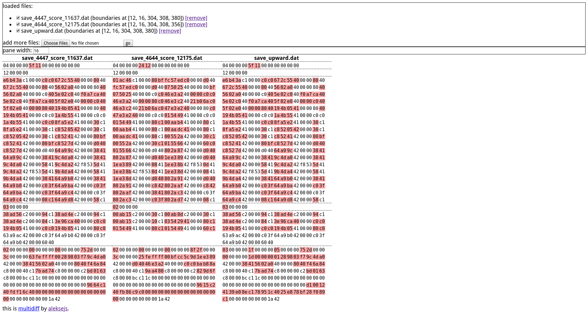

multidiff is a browser-based tool for comparing binary files.

Double-click a byte position to create a new segment starting at that position in that file. See screenshot above for why that is useful.
